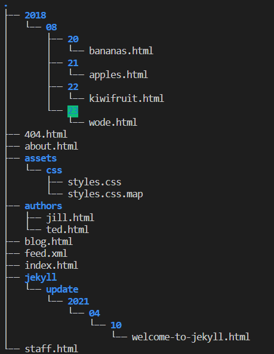
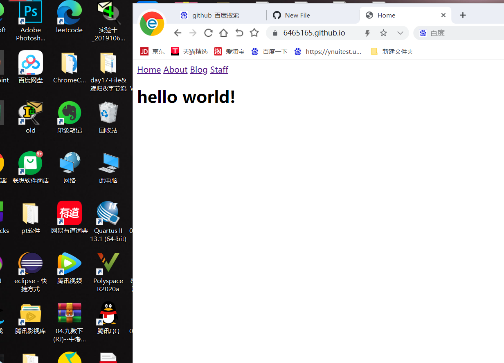
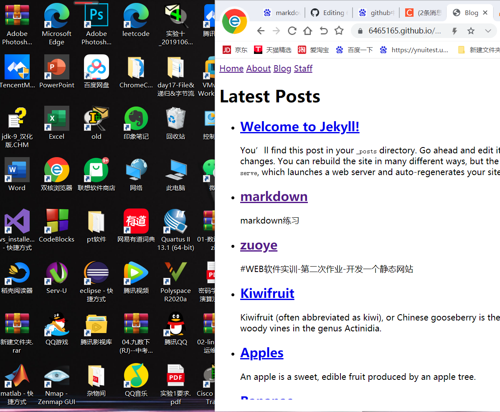
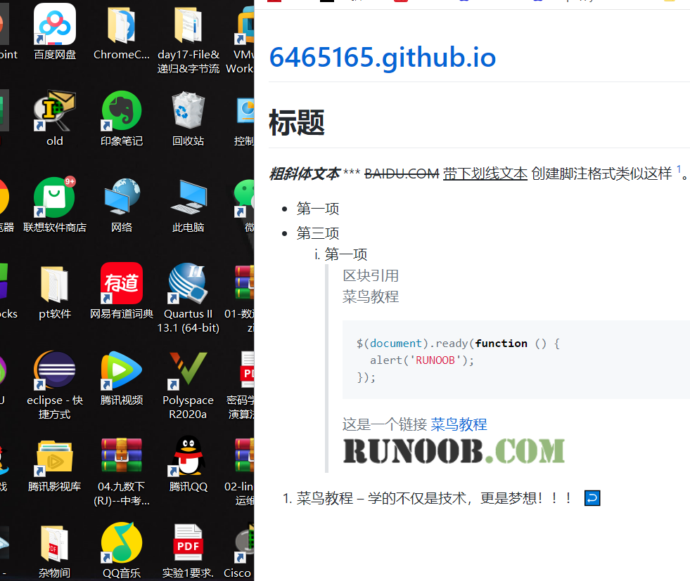
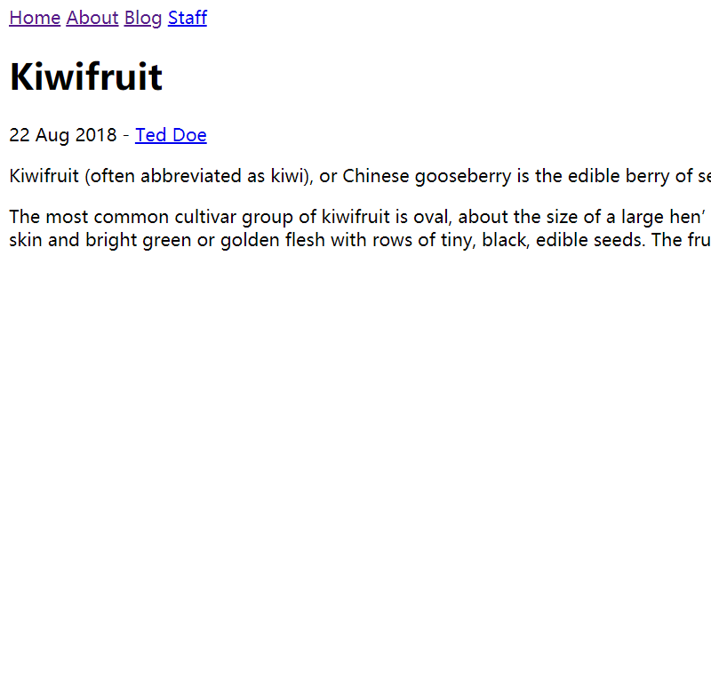
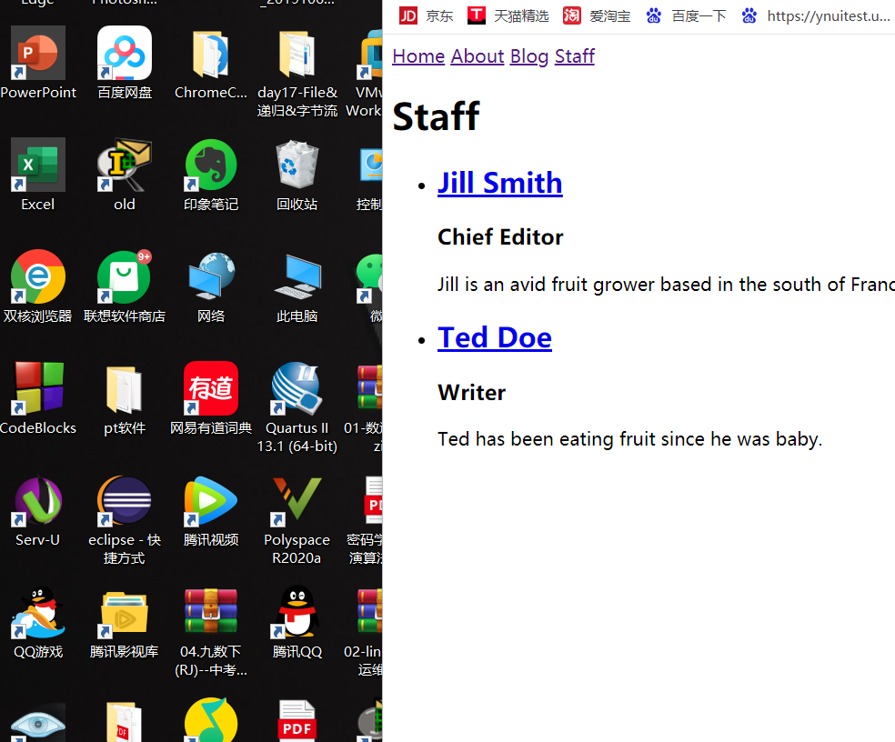
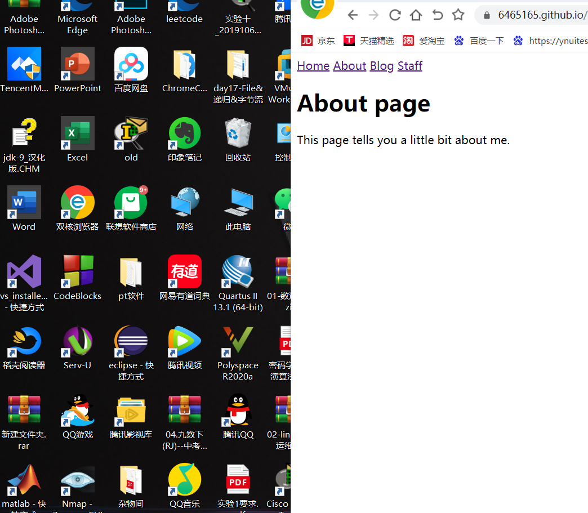

# WEB应用软件开发实训 - 第二次作业 - 开发一个静态网站
网站的公网网址:https://6465165.github.io
 
网站源代码Github仓库网址:https://github.com/6465165/6465165.github.io
## 一、网站目录结构

## 二、网站截图
 
首页：  

 
blog列表页：  

 
markdown练习：  
 

 
kiwifruit:
 

 
staff列表页:
 

 
作者简介页面：
 

 
about:
 

 
## 三、实验过程
 
按照实验指导书一步一步走
 
## 四、总结
 
在github上以.md结尾的，在做链接的时候要写成.html,不然会出现乱码
